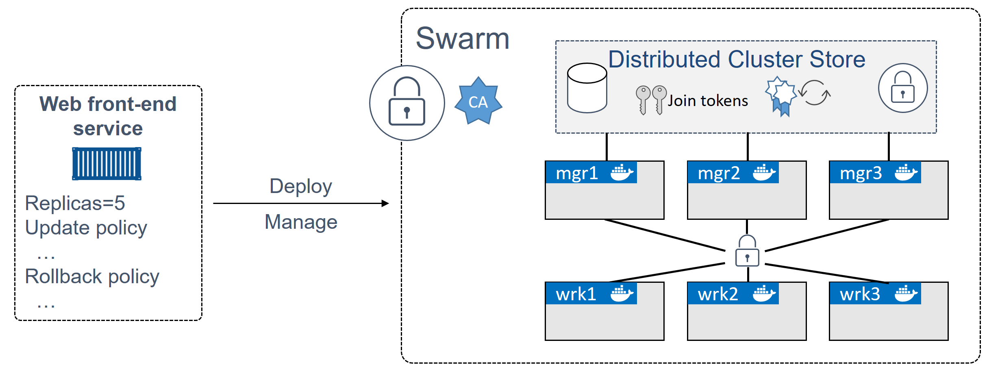
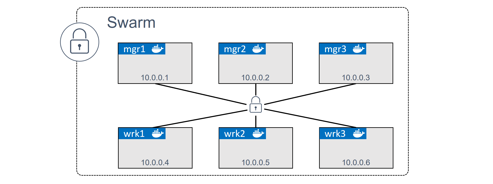

# Docker Swarm

Docker Swarm is two main things:

* An enterprise-grade secure cluster of Docker hosts
* An engine for orchestrating microservices apps

On the clustering front, Swarm groups one or more Docker nodes and lets you manage them as a cluster. Out-of-the-box, you get an encrypted distributed cluster store, encrypted networks, mutual TLS, secure cluster join tokens, and a PKI that makes managing and rotating certificates a breeze. You can even non-disruptively add and remove nodes

Nodes are configured as managers or workers. Managers look after the control plane of the cluster.

The configuration and state of the swarm is held in a distributed etcd database located on all managers. It’s kept in memory and is extremely up-to-date.

TLS is so tightly integrated that it’s impossible to build a swarm without it. 

Swarm uses TLS to encrypt communications, authenticate nodes, and authorize roles. Automatic key rotation is also thrown in

The atomic unit of scheduling on a swarm is the service. This is a higher level construct that wraps some advanced features around containers. These include scaling, rolling updates, and simple rollbacks.


## Build a secure Swarm cluster



On the networking front, you need the following ports open on routers and firewalls between nodes:

* 2377/tcp: for secure client-to-swarm communication
* 7946/tcp and udp: for control plane gossip
* 4789/udp: for VXLAN-based overlay networks

The process of building a swarm is called initializing a swarm, and the high-level process is this: Initialize the first manager node > Join additional manager nodes > Join worker nodes > Done.

## Initializing a new swarm

Docker nodes that are not part of a swarm are said to be in single-engine mode. Once they’re added to a swarm they’re automatically switched into swarm mode.

1. Initialize Manager(Leader)
```
$ docker swarm init \
  --advertise-addr 10.0.0.1:2377 \
  --listen-addr 10.0.0.1:2377
```

2. Generate token to add Worker, Manager(Follower)
```
$ docker swarm join-token worker
To add a manager to this swarm, run the following command:
   docker swarm join \
   --token SWMTKN-1-0uahebax...c87tu8dx2c \
   10.0.0.1:2377

$ docker swarm join-token manager
To add a manager to this swarm, run the following command:
   docker swarm join \
   --token SWMTKN-1-0uahebax...ue4hv6ps3p \
   10.0.0.1:2377
```

3. Log into Worker, Manager(Follower) and join them to Manager(Leader)
```
$ docker swarm join \
    --token SWMTKN-1-0uahebax...c87tu8dx2c \
    10.0.0.1:2377 \
    --advertise-addr 10.0.0.4:2377 \
    --listen-addr 10.0.0.4:2377

This node joined a swarm as a worker.

$ docker swarm join \
    --token SWMTKN-1-0uahebax...ue4hv6ps3p \
    10.0.0.1:2377 \
    --advertise-addr 10.0.0.2:2377 \
    --listen-addr 10.0.0.2:2377

This node joined a swarm as a manager.
```

4. List all the nodes
```
$ docker node ls
ID                            HOSTNAME   STATUS    AVAILABILITY   MANAGER STATUS   ENGINE VERSION
il22ax8931nszsx7qnnaxpq6c *   node1      Ready     Active         Leader           24.0.2
nyicqzmtbgz83ivao4elqa9sg     node2      Ready     Active         Reachable        24.0.2
mzowwhk5rtwzbty0xt087ogzc     node3      Ready     Active                          24.0.2
rdtj6v5yu4sv1tw8y0f4sviyx     node4      Ready     Active                          24.0.2
ycdfg3p57h3qfxvqg4wzvc9lt     node5      Ready     Active                          24.0.2
```

### Swarm manager high availability (HA)
Swarm implements a form of active-passive multi-manager HA. This means that although you have multiple managers, only one of them is active at any given moment. This active manager is called the “leader”, and the leader is the only one that will ever issue live commands against the swarm. So, it’s only ever the leader that changes the config, or issues tasks to workers. If a follower manager (passive) receives commands for the swarm, it proxies them across to the leader.

swarm uses an implementation of the Raft consensus algorithm to maintain a consistent cluster state across multiple highly available managers.

On the topic of HA, the following two best practices apply:

* Deploy an odd number of managers -> leader election might be tricky incase of network partition
* Don’t deploy too many managers (3 or 5 is recommended) -> As with all consensus algorithms, more participants means more time required to achieve consensus

### Built-in Swarm security
Ton of built-in security that’s configured out-of-the-box with sensible defaults — CA settings, join tokens, mutual TLS, encrypted cluster store, encrypted networks, cryptographic node ID’s and more.

### Locking a Swarm
Docker allows you to lock a swarm with the Autolock feature. This forces restarted managers to present the cluster unlock key before being admitted back into the cluster.

```
$ docker swarm update --autolock=true
Swarm updated.
To unlock a swarm manager after it restarts, run the `docker swarm unlock` command and 
provide the following key:

    SWMKEY-1-5+ICW2kRxPxZrVyBDWzBkzZdSd0Yc7Cl2o4Uuf9NPU4

Please remember to store this key in a password manager, since without it you will not be able
to restart the manager.
```

```
docker swarm unlock-key
```

Run this command from restarted manager
```
$ docker swarm unlock
Please enter unlock key: <enter your key>
```

Locking your swarm and protecting the unlock key is recommended for production environments.

## Swarm services
Services are a new construct introduced with Docker 1.12, and they only apply to swarm mode.

You can create services in one of two ways:

* Imperatively on the command line with docker service create
* Declaratively with a stack file

Creating service with 5 replica

```
docker service create --name web-fe \
   -p 8080:8080 \
   --replicas 5 \
   nigelpoulton/pluralsight-docker-ci
```
The command was sent to a manager node, and the manager acting as leader instantiated 5 replicas across the swarm — remember that swarm managers also act as workers.

The swarm leader also ensures a copy of the service’s desired state was stored on the cluster and replicated to every manager.

## Viewing and inspecting services

`docker service ls`

`docker service ps <service name/ID>`

`docker service inspect --pretty <service name/ID>`

### Replicated vs global services
The default replication mode of a service is replicated. This deploys a desired number of replicas and distributes them as evenly as possible across the cluster.

The other mode is `global`, which runs a single replica on every node in the swarm.

To deploy a global service you need to pass the `--mode global` flag to the docker service create command.

### Scaling a service

`docker service scale web-fe=10`

Behind the scenes, swarm runs a scheduling algorithm called “spread” that attempts to balance replicas as evenly as possible across the nodes in the swarm. At the time of writing, this amounts to running an equal number of replicas on each node without taking into consideration things like CPU load etc.

### Removing a service
`docker service rm web-fe`

### Rolling updates

```
Creating a service
$ docker service create --name uber-svc \
   --network uber-net \
   -p 8080:80 --replicas 12 \
   nigelpoulton/tu-demo:v1
```

Passing the service the -p 8080:80 flag will ensure that a swarm-wide mapping is created that maps all traffic, coming in to any node in the swarm on port 8080, through to port 80 inside of any service replica.

This mode of publishing a port on every node in the swarm — even nodes not running service replicas — is called `ingress mode` and is the default. The alternative mode is `host mode` which only publishes the service on swarm nodes running replicas. Publishing a service in host mode requires the long-form syntax and looks like the following:

```
$ docker service create --name uber-svc \
   --network uber-net \
   --publish published=80,target=80,mode=host \
   --replicas 12 \
   nigelpoulton/tu-demo:v1
```
you’ve been tasked with pushing the updated image to the swarm in a staged manner — 2 replicas at a time with a 20 second delay between each.
```
$ docker service update \
   --image nigelpoulton/tu-demo:v2 \
   --update-parallelism 2 \
   --update-delay 20s uber-svc
uber-svc
overall progress: 2 out of 12 tasks 
1/12: running   [==================================================>] 
2/12: running   [==================================================>] 
3/12: starting  [============================================>      ] 
4/12: starting  [============================================>      ] 
5/12:   
6/12:   
7/12:   
8/12:   
9/12:   
10/12:   
11/12:   
12/12:  
```

You should also note a couple of things about the service’s network config. All nodes in the swarm that are running a replica for the service will have the uber-net overlay network that we created earlier. We can verify this by running docker network ls on any node running a replica.


### Troubleshooting

By default, Docker nodes configure services to use the json-file log driver, but other drivers exist, including:

* journald (only works on Linux hosts running systemd)
* syslog
* splunk
* gelf

`docker service logs <service-name>`

Service logs work on the premise that your application is running as PID 1 in its container and sending logs to STDOUT and errors to STDERR. The logging driver forwards these “logs” to the locations configured via the logging driver.

### Backing up Swarm

Backing up a swarm will backup the control plane objects required to recover the swarm in the event of a catastrophic failure of corruption. 

consider the scenario where a malicious actor deletes all of the Secrets on a swarm. HA cannot help in this scenario as the Secrets will be deleted from the cluster store that is automatically replicated to all manager nodes. In this scenario the highly-available replicated cluster store works against you — quickly propagating the delete operation. In this scenario you can either recreate the deleted objects from copies kept in a source code repo, or you can attempt to recover your swarm from a recent backup.

Managing your swarm and applications declaratively is a great way to prevent the need to recover from a backup. For example, storing configuration objects outside of the swarm in a source code repository will enable you to redeploy things like networks, services, secrets and other objects. 

Swarm configuration and state is stored in /var/lib/docker/swarm on every manager node. The configuration includes; Raft log keys, overlay networks, Secrets, Configs, Services, and more. A swarm backup is a copy of all the files in this directory.

# Chapter summary
Docker Swarm is Docker’s native technology for managing clusters of Docker nodes and deploying and managing cloud-native applications. It is similar to Kubernetes.

At its core, Swarm has a secure clustering component, and an orchestration component.

The secure clustering component is enterprise-grade and offers a wealth of security and HA features that are automatically configured and extremely simple to modify.

The orchestration component allows you to deploy and manage cloud-native microservices applications in a simple declarative manner.