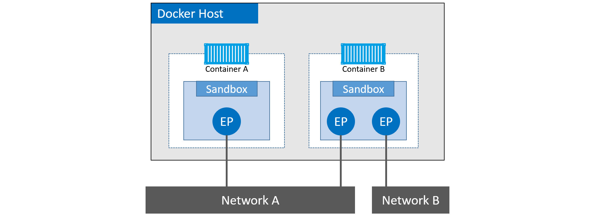

# Docker Networking

Docker networking is based on an open-source pluggable architecture called the `Container Network Model (CNM)`. `libnetwork` is Docker’s real-world implementation of the CNM.

Docker ships with a set of native drivers that deal with the most common networking requirements. These include single-host bridge networks, multi-host overlays, and options for plugging into existing VLANs.

`libnetwork` provides a native service discovery and basic container load balancing solution.

At the highest level, Docker networking comprises three major components:

* The Container Network Model (CNM)
* libnetwork
* Drivers

The CNM is the design specification. It outlines the fundamental building blocks of a Docker network.

libnetwork is a real-world implementation of the CNM, and is used by Docker. It’s written in Go, and implements the core components outlined in the CNM.

Drivers extend the model by implementing specific network topologies such as VXLAN overlay networks.

## The Container Network Model (CNM)

Three major building blocks:

* Sandboxes
* Endpoints
* Networks

A `sandbox` is an isolated network stack. It includes; Ethernet interfaces, ports, routing tables, and DNS config.

When a container is created, it is assigned a `sandbox`, which includes its own network namespace.

The sandbox provides network isolation, ensuring that containers have their own unique networking environment and do not interfere with each other or the host system.

`Endpoints` are virtual network interfaces (E.g. veth). Like normal network interfaces, they’re responsible for making connections. In the case of the CNM, it’s the job of the endpoint to connect a sandbox to a network.

`Networks` are a software implementation of an switch (802.1d bridge). As such, they group together and isolate a collection of endpoints that need to communicate.

Two endpoints in Container B cannot communicate with each other without the assistance of a layer 3 router.

It’s also important to understand that endpoints behave like regular network adapters, meaning they can only be connected to a single network. Therefore, if a container needs connecting to multiple networks, it will need multiple endpoints.

Although Container A and Container B are running on the same host, their network stacks are completely isolated at the OS-level via the sandboxes.

## Libnetwork

The CNM is the design doc, and libnetwork is the canonical implementation. It’s open-source, written in Go, cross-platform (Linux and Windows), and used by Docker.

it implements all three of the components defined in the CNM. It also implements native service discovery, ingress-based container load balancing, and the network control plane and management plane functionality.

## Drivers

If libnetwork implements the control plane and management plane functions, then drivers implement the data plane. For example, connectivity and isolation is all handled by drivers. So is the actual creation of networks.

Each driver is in charge of the actual creation and management of all resources on the networks it is responsible

## Single-host bridge networks