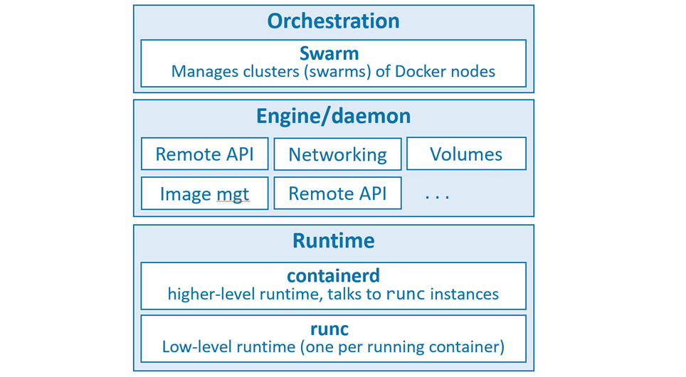

# Docker

Docker is currently built from various tools from the Moby open-source project.

Three layers of docker

- The runtime operates at the lowest level and is responsible for starting and stopping containers (this includes building all of the OS constructs such as namespaces and cgroups). 

- The low-level runtime is called runc and is the reference implementation of Open Containers Initiative (OCI) runtime-spec. Its job is to interface with the underlying OS and start and stop containers. Every running container on a Docker node has a runc instance managing it.

- The higher-level runtime is called containerd. containerd does a lot more than runc. It manages the entire lifecycle of a container, including pulling images, creating network interfaces, and managing lower-level runc instances. 

- A typical Docker installation has a single containerd process (docker-containerd)

- The Docker daemon (dockerd) sits above containerd and performs higher-level tasks such as; exposing the Docker remote API, managing images, managing volumes, managing networks, and more…

- A major job of the Docker daemon is to provide an easy-to-use standard interface that abstracts the lower levels.

## The Open Container Initiative (OCI)

Responsible for standardizing the low-level fundamental components of container infrastructure. In particular it focusses on image format and container runtime.

The OCI has published two specifications (standards)
* The image-spec
* The runtime-spec

# Chapter summary
In this chapter, we learned about Docker, Inc. the company, and the Docker technology.

Docker, Inc. is a technology company out of San Francisco with an ambition to change the way we do software. They were arguably the first-movers and instigators of the modern container revolution.

The Docker technology focuses on running and managing application containers. It runs on Linux and Windows, can be installed almost anywhere, and is currently the most popular container runtime used by Kubernetes.

The Open Container Initiative (OCI) was instrumental in standardizing the container runtime format and container image format.