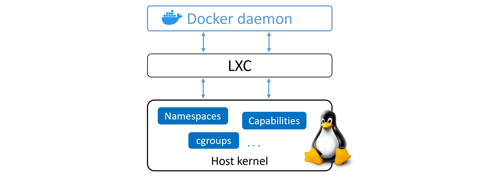

# The Docker Engine
- The Docker engine is the core software that runs and manages containers. We often refer to it simply as Docker.

- The Docker engine is modular in design and built from many small specialised tools. Where possible, these are based on open standards such as those maintained by the Open Container Initiative (OCI).

- The Docker Engine is made from many specialized tools that work together to create and run containers — APIs, execution driver, runtimes, shims etc.

- The major components that make up the Docker engine are; the Docker daemon, containerd, runc, and various plugins such as networking and storage. Together, these create and run containers.

## Docker Engine - The Deep Dive

When Docker was first released, the Docker engine had two major components:

* The Docker daemon (was a monolithic binary)
* LXC

The Docker daemon was a monolithic binary. It contained all of the code for the Docker client, the Docker API, the container runtime, image builds, and much more.

LXC provided the daemon with access to the fundamental building-blocks of containers that existed in the Linux kernel. Things like namespaces and control groups (cgroups).

### Getting rid of LXC

* LXC is Linux-specific.
* Being reliant on an external tool for something so core to the project was a huge risk that could hinder development.
* As a result, Docker. Inc. developed their own tool called `libcontainer` as a replacement for LXC which is platform-agnostic.
* `Libcontainer` replaced LXC as the default execution driver in Docker 0.9.

### Getting rid of the monolithic Docker daemon
* Aim of this work was to break out as much of the functionality as possible from the daemon, and re-implement it in smaller specialized tools.
* This work of breaking apart and re-factoring the Docker engine has seen all of the container execution and container runtime code entirely removed from the daemon and refactored into small, specialized tools.

### The influence of the Open Container Initiative (OCI)
Container-related OCI specifications
* Image spec
* Container runtime spec

The Docker daemon no longer contains any container runtime code — all container runtime code is implemented in a separate OCI-compliant layer. By default, Docker uses `runc` for this. `runc` is the reference implementation of the OCI container-runtime-spec.

As well as this, the `containerd` component of the Docker Engine makes sure Docker images are presented to `runc` as valid OCI bundles.

### runc
* If you strip everything else away, runc is a small, lightweight CLI wrapper for `libcontainer`

* `runc` has a single purpose — create containers.

* It’s effectively a standalone container runtime tool. This means you can download and build the binary, and you’ll have everything you need to build and play with runc (OCI) containers. But it’s bare bones and very low-level

### containerd
*  All of the container execution logic was ripped out from docker daemon and refactored into a new tool called `containerd`. Its sole purpose in life was to manage container lifecycle operations — start | stop | pause | rm....

* It also takes care of image pulls, volumes and networks.However, all the extra functionality is modular and optional,

* `containerd` was developed by Docker, Inc. and donated to the Cloud Native Computing Foundation (CNCF)

## Starting a new container (example)

### One huge benefit of this model

* Entire container runtime is decoupled from the Docker daemon.We sometimes call this “daemonless containers”
* Makes it possible to perform maintenance and upgrades on the Docker daemon without impacting running containers!
* When all of container runtime logic was implemented in the daemon, starting and stopping the daemon would kill all running containers on the host.

### What’s this shim all about?

* `containerd` uses runc to create new containers. In fact, it forks a new instance of runc for every container it creates. However, once each container is created, the parent runc process exits. 

* Once a container’s parent runc process exits, the associated containerd-shim process becomes the container’s parent. 

Some of the responsibilities the shim performs as a container’s parent include:

- Keeping any STDIN and STDOUT streams open so that when the daemon is restarted, the container doesn’t terminate due to pipes being closed etc.
- Reports the container’s exit status back to the daemon.

### How it’s implemented on Linux

On a Linux system, the components we’ve discussed are implemented as separate binaries as follows:

* dockerd (the Docker daemon)
* docker-containerd (containerd)
* docker-containerd-shim (shim)
* docker-runc (runc)

### What’s the point of the daemon
* some of the major functionality that still exists in the daemon includes; image management, image builds, the REST API, authentication, security, core networking, and orchestration.

### Securing client and daemon communication
Docker implements a client-server model.

* The client component implements the CLI
* The server (daemon) component implements the functionality, including the public-facing REST API

The client is called docker (docker.exe on Windows) and the daemon is called dockerd (dockerd.exe on Windows). A default installation puts them on the same host and configures them to communicate over a local IPC socket:

* /var/run/docker.sock on Linux
* //./pipe/docker_engine on Windows

It’s also possible to configure them to communicate over the network. By default, network communication occur over an unsecured HTTP socket on port 2375/tcp.

Docker lets you force the client and daemon to only accept network connections that are secured with TLS. This is recommended for production environments, even if all traffic is traversing trusted internal networks.

You can secure both the client and the daemon. Securing the client forces the client to only connect to Docker daemons with certificates signed by a trusted Certificate Authority (CA). Securing the daemon forces the daemon to only accept connections from clients presenting certificates from a trusted CA. A combination of both modes offers the most security.

# Chapter summary
The Docker engine is modular in design and based heavily on open-standards from the OCI.

The Docker daemon implements the Docker API which is currently a rich, versioned, HTTP API that has developed alongside the rest of the Docker project.

Container execution is handled by containerd. containerd was written by Docker, Inc. and contributed to the CNCF. You can think of it as a container supervisor that handles container lifecycle operations. It is small and lightweight and can be used by other projects and third-party tools. For example, it’s becoming the most common container runtime in Kubernetes.

containerd needs to talk to an OCI-compliant container runtime to actually create containers. By default, Docker uses runc as its default container runtime. runc is the de facto implementation of the OCI runtime-spec and expects to start containers from OCI-compliant bundles. containerd talks to runc and ensures Docker images are presented to runc as OCI-compliant bundles.

runc can be used as a standalone CLI tool to create containers. It’s based on code from libcontainer, and can also be used by other projects and third-party tools.

There is still a lot of functionality implemented in the Docker daemon. More of this may be broken out over time. Functionality currently still inside of the Docker daemon includes, but is not limited to; the Docker API, image management, authentication, security features and core networking.

