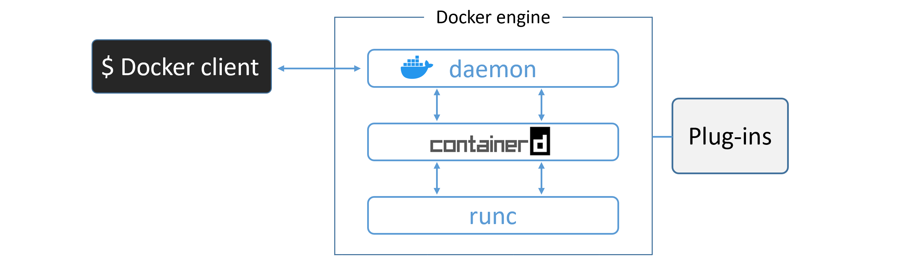

# The Docker Engine
- The Docker engine is the core software that runs and manages containers. We often refer to it simply as Docker.

- The Docker engine is modular in design and built from many small specialised tools. Where possible, these are based on open standards such as those maintained by the Open Container Initiative (OCI).

- The Docker Engine is made from many specialized tools that work together to create and run containers — APIs, execution driver, runtimes, shims etc.

- The major components that make up the Docker engine are; the Docker daemon, containerd, runc, and various plugins such as networking and storage. Together, these create and run containers.

## Docker Engine - The Deep Dive

When Docker was first released, the Docker engine had two major components:

* The Docker daemon (was a monolithic binary)
* LXC

The Docker daemon was a monolithic binary. It contained all of the code for the Docker client, the Docker API, the container runtime, image builds, and much more.

LXC provided the daemon with access to the fundamental building-blocks of containers that existed in the Linux kernel. Things like namespaces and control groups (cgroups).

### Getting rid of LXC

* LXC is Linux-specific.
* Being reliant on an external tool for something so core to the project was a huge risk that could hinder development.
* As a result, Docker. Inc. developed their own tool called `libcontainer` as a replacement for LXC which is platform-agnostic.
* `Libcontainer` replaced LXC as the default execution driver in Docker 0.9.

### Getting rid of the monolithic Docker daemon
* Aim of this work was to break out as much of the functionality as possible from the daemon, and re-implement it in smaller specialized tools.
* This work of breaking apart and re-factoring the Docker engine has seen all of the container execution and container runtime code entirely removed from the daemon and refactored into small, specialized tools.

### The influence of the Open Container Initiative (OCI)
Container-related OCI specifications
* Image spec
* Container runtime spec

The Docker daemon no longer contains any container runtime code — all container runtime code is implemented in a separate OCI-compliant layer. By default, Docker uses `runc` for this. `runc` is the reference implementation of the OCI container-runtime-spec.

As well as this, the `containerd` component of the Docker Engine makes sure Docker images are presented to `runc` as valid OCI bundles.

### runc
* If you strip everything else away, runc is a small, lightweight CLI wrapper for `libcontainer`

* `runc` has a single purpose — create containers.

* It’s effectively a standalone container runtime tool. This means you can download and build the binary, and you’ll have everything you need to build and play with runc (OCI) containers. But it’s bare bones and very low-level

### containerd
*  All of the container execution logic was ripped out from docker daemon and refactored into a new tool called `containerd`. Its sole purpose in life was to manage container lifecycle operations — start | stop | pause | rm....

* It also takes care of image pulls, volumes and networks.However, all the extra functionality is modular and optional,

* `containerd` was developed by Docker, Inc. and donated to the Cloud Native Computing Foundation (CNCF)

