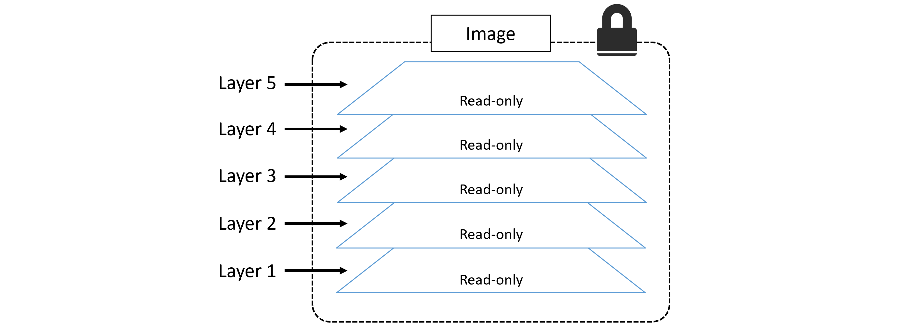

# Images

Images are made up of multiple layers that are stacked on top of each other and represented as a single object. Inside of the image is a cut-down operating system (OS) and all of the files and dependencies required to run an application

Image don’t contain a kernel — all containers running on a Docker host share access to the host’s kernel. For these reasons, we sometimes say images contain just enough operating system (usually just OS-related files and filesystem objects).

### Pulling images
The local image repository on a Linux-based Docker host is usually located at `/var/lib/docker/<storage-driver>`

``` 
docker image pull <repository>:<tag>

docker image pull redis:latest

docker image pull mongo:4.2.6

docker image pull nigelpoulton/tu-demo:v2

docker image pull gcr.io/google-containers/git-sync:v3.1.5

docker image pull -a nigelpoulton/tu-demo # pulling all images in a repository
```

 if you do not specify an image tag after the repository name, Docker will assume you are referring to the image tagged as latest. If the repository doesn’t have an image tagged as latest the command will fail, tagged as latest does not guarantee it is the most recent image in a repository


 ### Filtering the output of docker image ls

 `docker image ls --filter dangling=true`

 Docker currently supports the following filters:

* `dangling`: Accepts true or false, and returns only dangling images (true), or non-dangling images (false).
* `before`: Requires an image name or ID as argument, and returns all images created before it.
* `since`: Same as above, but returns images created after the specified image.
* `label`: Filters images based on the presence of a label or label and value. The docker image ls command does not display labels in its output.

For all other filtering you can use `reference`.

```
$ docker image ls --filter=reference="*:latest"
REPOSITORY   TAG      IMAGE ID        CREATED        SIZE
alpine       latest   f70734b6a266    3 days ago     5.61MB
redis        latest   a4d3716dbb72    3 days ago     98.3MB
busybox      latest   be5888e67be6    12 days ago    1.22MB
```
### Searching Docker Hub from the CLI

```
docker search nigelpoulton
docker search alpine
docker search alpine --filter "is-official=true"
docker search alpine --filter "is-automated=true"
```

By default, Docker will only display 25 lines of results. However, you can use the --limit flag to increase that to a maximum of 100.

### Images and layers

A Docker image is just a bunch of loosely-connected read-only layers, with each layer comprising one or more files.


```
$ docker image pull ubuntu:latest
latest: Pulling from library/ubuntu
952132ac251a: Pull complete
82659f8f1b76: Pull complete
c19118ca682d: Pull complete
8296858250fe: Pull complete
24e0251a0e2c: Pull complete
Digest: sha256:f4691c96e6bbaa99d...28ae95a60369c506dd6e6f6ab
Status: Downloaded newer image for ubuntu:latest
docker.io/ubuntu:latest
```

Each pull represent a layer and their IDs.

Another way to see the layers of an image is to inspect the image with the docker image inspect command

```
$ docker image inspect ubuntu:latest
```

All Docker images start with a base layer, and as changes are made and new content is added, new layers are added on top.

Docker employs a storage driver that is responsible for stacking layers and presenting them as a single unified filesystem/image, so that all layers are stacked and merged, giving a single unified view.

### Sharing image layers

Multiple images can, and do, share layers. This leads to efficiencies in space and performance.

```
$ docker image pull -a nigelpoulton/tu-demo
latest: Pulling from nigelpoulton/tu-demo
aad63a933944: Pull complete 
f229563217f5: Pull complete 
<Snip>>
Digest: sha256:c9f8e18822...6cbb9a74cf

v1: Pulling from nigelpoulton/tu-demo
aad63a933944: Already exists 
f229563217f5: Already exists 
<Snip> 
fc669453c5af: Pull complete 
Digest: sha256:674cb03444...f8598e4d2a

v2: Pulling from nigelpoulton/tu-demo
Digest: sha256:c9f8e18822...6cbb9a74cf
Status: Downloaded newer image for nigelpoulton/tu-demo
docker.io/nigelpoulton/tu-demo

$ docker image ls
REPOSITORY             TAG       IMAGE ID       CREATED       SIZE
nigelpoulton/tu-demo   latest    d5e1e48cf932   2 weeks ago   104MB
nigelpoulton/tu-demo   v2        d5e1e48cf932   2 weeks ago   104MB
nigelpoulton/tu-demo   v1        6852022de69d   2 weeks ago   104MB
```

Notice the lines ending in Already exists.

These lines tell us that Docker is smart enough to recognize when it’s being asked to pull an image layer that it already has a local copy of.

### Pulling images by digest
 Tags are mutable! This means it’s possible to accidentally tag an image with the wrong tag (name). Sometimes, it’s even possible to tag an image with the same tag as an existing, but different, image. This can cause problems!

 Docker 1.10 introduced a content addressable storage model. As part of this model, all images get a cryptographic content hash which is immutable

 ```
 $ docker image rm alpine:latest
Untagged: alpine:latest
Untagged: alpine@sha256:c0537...7c0a7726c88e2bb7584dc96
Deleted: sha256:02674b9cb179d...abff0c2bf5ceca5bad72cd9
Deleted: sha256:e154057080f40...3823bab1be5b86926c6f860

$ docker image pull alpine@sha256:9a839e63da...9ea4fb9a54
sha256:9a839e63da...9ea4fb9a54: Pulling from library/alpine
cbdbe7a5bc2a: Pull complete 
Digest: sha256:9a839e63da...9ea4fb9a54
Status: Downloaded newer image for alpine@sha256:9a839e63da...9ea4fb9a54
docker.io/library/alpine@sha256:9a839e63da...9ea4fb9a54
```

### A little bit more about image hashes (digests)

Since Docker version 1.10, an image is a very loose collection of independent layers.

In some ways, the image itself is just a configuration file that lists the layers and some metadata.

Each image is identified by a crypto ID that is a hash of the config file. Each layer is identified by a crypto ID that is a hash of the layer content. we call these “content hashes”.

Hash of the compressed version of the layer is included with every layer pushed or pulled to a registry. 

### Multi-architecture images

Wou can run a simple docker image pull goloang:latest from any platform or architecture and Docker will pull the correct image for your platform and architecture.

To make this happen, the Registry API supports two important constructs:

* manifest lists (list of architectures supported by a particular image tag)
* manifests (Each supported architecture then has its own *manifest detailing the layers that make it up.)

```
docker manifest inspect golang | grep 'architecture\|os'
            "architecture": "amd64",
            "os": "linux"
            "architecture": "arm",
            "os": "linux",
            "architecture": "arm64",
            "os": "linux",
            "architecture": "386",
            "os": "linux"
            "architecture": "ppc64le",
            "os": "linux"
            "architecture": "s390x",
            "os": "linux"
            "architecture": "amd64",
            "os": "windows",
            "os.version": "10.0.14393.3630"
            "architecture": "amd64",
            "os": "windows",
            "os.version": "10.0.17763.1158"

```

You can create your own builds for different platforms and architectures with docker `buildx` and then use `docker manifest` create to create your own manifest lists.

### Deleting Images


```
docker image rm 02674b9cb179
docker image rm f70734b6a266 a4d3716dbb72
```