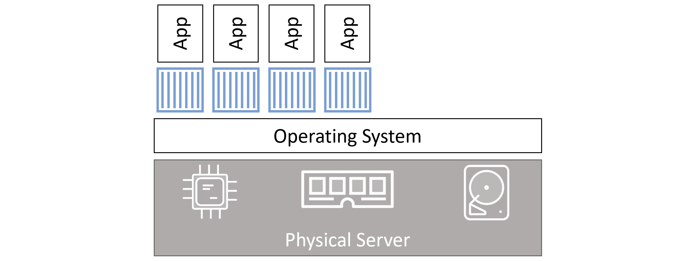

# Containers

`docker container run <image> <app>`

```
docker container run -it ubuntu /bin/bash

docker container stop

docker container start

docker container rm
```

In each of the examples, the -it flags will connect your current terminal window to the container’s shell.

Containers run until the app they are executing exits. In the previous examples, the Linux container will exit when the Bash shell exits, 

### Containers vs VMs
At a high level, hypervisors perform hardware virtualization — they carve up physical hardware resources into virtual versions called VMs. On the other hand, containers perform OS virtualization — they carve OS resources into virtual versions called containers.


Virtual machines


Containers

one thing that’s not so great about the container model is security. Out of the box, containers are less secure and provide less workload isolation than VMs.

### Running containers

```
soaib@soaib:~/Public/Docker$ docker container run -it ubuntu:latest /bin/bash

root@e21a97af8362:/boot# soaib@soaib:~/Public/Docker$ docker container ls
CONTAINER ID   IMAGE           COMMAND       CREATED         STATUS         PORTS     NAMES
e21a97af8362   ubuntu:latest   "/bin/bash"   2 minutes ago   Up 2 minutes             affectionate_chebyshev

# CTRL + P + Q to exit from terminal

soaib@soaib:~/Public/Docker$ docker container exec -it e21a97af8362 bash # this will start new bash process and attach to that, not the earlier running shell

root@e21a97af8362:/# ps -elf
F S UID          PID    PPID  C PRI  NI ADDR SZ WCHAN  STIME TTY          TIME CMD
4 S root           1       0  0  80   0 -  1156 do_sel 10:25 pts/0    00:00:00 /bin/bash
4 S root          12       0  0  80   0 -  1157 do_wai 10:30 pts/1    00:00:00 bash
0 R root          21      12  0  80   0 -  1765 -      10:30 pts/1    00:00:00 ps -elf

root@e21a97af8362:/# exit
exit

soaib@soaib:~/Public/Docker$ docker container ps
CONTAINER ID   IMAGE           COMMAND       CREATED         STATUS         PORTS     NAMES
e21a97af8362   ubuntu:latest   "/bin/bash"   6 minutes ago   Up 6 minutes             affectionate_chebyshev

# as the primary process (ie bin/bash) is still running container is not terminated yet

soaib@soaib:~/Public/Docker$ docker container stop e21a97af8362
e21a97af8362

soaib@soaib:~/Public/Docker$ docker container ps
CONTAINER ID   IMAGE     COMMAND   CREATED   STATUS    PORTS     NAME

```
### Container lifecycle

You can stop, start, pause, and restart a container as many times as you want. It’s not until you explicitly delete a container that you run a chance of losing its data. Even then, if you’re storing data outside the container in a volume, that data’s going to persist even after the container has gone.

### Self-healing containers with restart policies
* always (if daemon was restarted then exited container will restart)
* unless-stopped (if daemon was restarted then exited container will not restart)
* on-failed (will restart a container if it exits with a non-zero exit code)

```
docker container run --name neversaydie -it --restart always alpine sh
```

```
    restart_policy:
      condition: always | unless-stopped | on-failure
```

# Chapter summary
In this chapter, we compared and contrasted the container and VM models. We looked at the OS tax problem inherent in the VM model, and saw how the container model can bring huge advantages in much the same way as the VM model brought huge advantages over the physical server model.

We saw how to use the docker container run command to start a couple of simple containers, and we saw the difference between interactive containers in the foreground versus containers running in the background.

We know that killing the PID 1 process inside of a container will kill the container. And we’ve seen how to start, stop, and delete containers.

We finished the chapter using the docker container inspect command to view detailed container metadata.

So far so good!