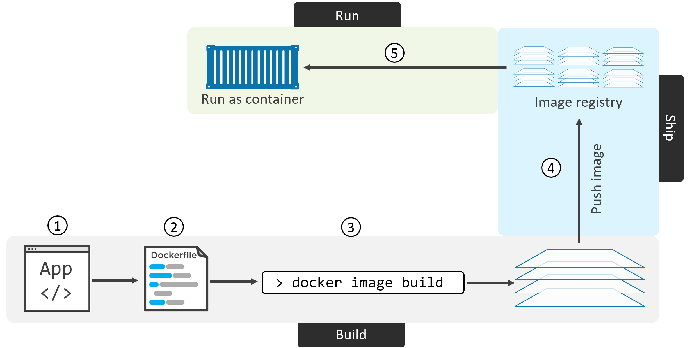
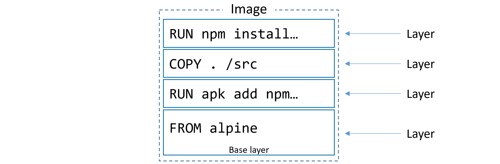
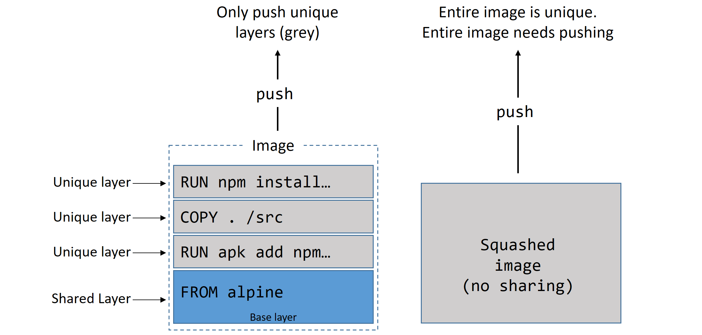

# Containerizing an app

The process of containerizing an app looks like this:

1. Start with your application code and dependencies
2. Create a Dockerfile that describes your app, its dependencies, and how to run it
3. Feed the Dockerfile into the docker image build command
4. Push the new image to a registry (optional)
5. Run container from the image



The directory containing the application and dependencies is referred to as the build context. It’s a common practice to keep your Dockerfile in the root directory of the build context.

```
FROM alpine # layer 1
LABEL maintainer="nigelpoulton@hotmail.com" # metadata
RUN apk add --update nodejs nodejs-npm # layer 2
COPY . /src # layer 2
WORKDIR /src # metedata
RUN npm install # layer 4
EXPOSE 8080 # metadata
ENTRYPOINT ["node", "./app.js"] # metadata
```


```
docker image build -t web:latest .
```

The docker image build command parses the Dockerfile one-line-at-a-time starting from the top.

All non-comment lines are Instructions and take the format INSTRUCTION argument. Instruction names are not case sensitive, but it’s normal practice to write them in UPPERCASE. This makes reading the Dockerfile easier.

Some instructions create new layers, whereas others just add metadata to the image config file.

# Moving to production with Multi-stage Builds

Multi-stage builds have a single Dockerfile containing multiple FROM instructions. Each FROM instruction is a new build stage that can easily COPY artefacts from previous stages.

```
# Stage 1: Build the application
FROM node:14 AS builder
WORKDIR /app
COPY package.json package-lock.json ./
RUN npm ci
COPY . .
RUN npm run build

# Stage 2: Create the final image
FROM nginx:alpine
COPY --from=builder /app/dist /usr/share/nginx/html
EXPOSE 80
CMD ["nginx", "-g", "daemon off;"]
```

```
FROM node:latest AS storefront
WORKDIR /usr/src/atsea/app/react-app
COPY react-app .
RUN npm install
RUN npm run build

FROM maven:latest AS appserver
WORKDIR /usr/src/atsea
COPY pom.xml .
RUN mvn -B -f pom.xml -s /usr/share/maven/ref/settings-docker.xml dependency:resolve
COPY . .
RUN mvn -B -s /usr/share/maven/ref/settings-docker.xml package -DskipTests

FROM java:8-jdk-alpine AS production
RUN adduser -Dh /home/gordon gordon
WORKDIR /static
COPY --from=storefront /usr/src/atsea/app/react-app/build/ .
WORKDIR /app
COPY --from=appserver /usr/src/atsea/target/AtSea-0.0.1-SNAPSHOT.jar .
ENTRYPOINT ["java", "-jar", "/app/AtSea-0.0.1-SNAPSHOT.jar"]
CMD ["--spring.profiles.active=postgres"]
```

## A few best practices

### Leverage the build cache
Try and write in a way that places instructions that are likely to invalidate the cache towards the end of the Dockerfile. This means that a cache-miss will not occur until later stages of the build - allowing the build to benefit as much as possible from the cache.

You can force the build process to ignore the entire cache by passing the `--no-cache=true `flag to the `docker image build` command.

Docker performs a checksum against each file being copied, and compares that to a checksum of the same file in the cached layer. If the checksums do not match, the cache is invalidated and a new layer is built.

### Squash the image
Squashing an image isn’t really a best practice as it has pros and cons.

Squashing can be good in situations where images are starting to have a lot of layers and this isn’t ideal. An example might be when creating a new base image that you want to build other images from in the future — this base is much better as a single-layer image.

At a high level, Docker follows the normal process to build an image, but then adds an additional step that squashes everything into a single layer.

When you run a container from a Docker image, the layers are combined dynamically by the Docker engine to create a unified view of the filesystem. This unified view includes the files and changes introduced by each layer.



### Use no-install-recommends
If you are building Linux images, and using the apt package manager, you should use the no-install-recommends flag with the apt-get install command. This makes sure that apt only installs main dependencies (packages in the Depends field) and not recommended or suggested packages. 