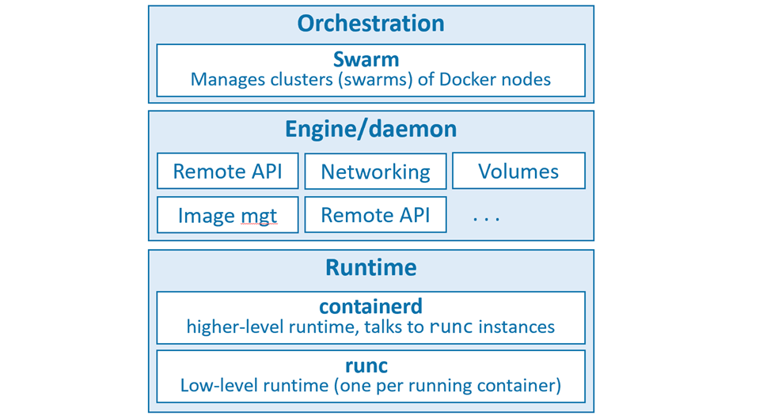

# Containers from 30,000 feet

## The bad old days

In the past we could only run one application per server.
The open-systems world of Windows and Linux just didn’t have the technologies to safely and securely run multiple applications on the same server.
As a result, the story went something like this… Every time the business needed a new application, the IT department would buy a new server. 
Most of the time nobody knew the performance requirements of the new application, 
forcing the IT department to make guesses when choosing the model and size of the server to buy.

## Hello VMware!

Virtual machine (VM) allowed us to safely and securely run multiple business applications on a single server. 
IT departments no longer needed to procure a brand-new oversized server every time the business needed a new application, but
- Every VM requires its own dedicated operating system (OS) is a major flaw. 
- Every OS consumes CPU, RAM and other resources that could otherwise be used to power more applications
- VMs are slow to boot, and portability isn’t great
- Migrating and moving VM workloads between hypervisors and cloud platforms is harder than it needs to be.

## Hello Containers!

In the container model, the container is roughly analogous to the VM. A major difference is that containers do not require their own full-blown OS. In fact, all containers on a single host share the host’s OS

- Reduces the overhead of OS patching and other maintenance.
- Containers are also fast to start and ultra-portable.
- Moving container workloads from your laptop, to the cloud, and then to VMs or bare metal in your data center is a breeze.

## Linux containers

Some of the major technologies that enabled the massive growth of containers in recent years include; kernel namespaces, control groups, union filesystems, and of course Docker.

Despite all of this, containers remained complex and outside of the reach of most organizations. It wasn’t until Docker came along that containers were effectively democratized and accessible to the masses.mespaces, control groups, union filesystems, and of course Docker.

## Windows containers
The core Windows kernel technologies required to implement containers are collectively referred to as Windows Containers. The user-space tooling to work with these Windows Containers can be Docker.

## Linux vs windows vs mac container
 Running container shares the kernel of the host machine it is running on. This means that a containerized Windows app will not run on a Linux-based Docker host, and vice-versa.

 Windows container depending upon version of docker desktop might run either on top of Hyper-V VM or WSL and there is currently no such thing as Mac containers. However, we can run Linux containers on your Mac using Docker Desktop which runs containers inside of a lightweight Linux VM

 ## What about Kubernetes
 Kubernetes uses Docker as its default container runtime — the low-level technology that pulls images and starts and stops containers. However, Kubernetes has a pluggable container runtime interface (CRI) that makes it easy to swap-out Docker for a different container runtime. In the future, Docker might be replaced by containerd as the default container runtime in Kubernetes.

# Chapter Summary

We used to live in a world where every time the business wanted a new application we had to buy a brand-new server. VMware came along and enabled us to drive more value out of new and existing company IT assets. As good as VMware and the VM model is, it’s not perfect. Following the success of VMware and hypervisors came a newer more efficient and lightweight virtualization technology called containers. But containers were initially hard to implement and were only found in the data centers of web giants that had Linux kernel engineers on staff. Along came Docker, Inc. and suddenly containers were available to the masses.

# Docker

Docker is currently built from various tools from the Moby open-source project.

Three layers of docker


- The runtime operates at the lowest level and is responsible for starting and stopping containers (this includes building all of the OS constructs such as namespaces and cgroups). 

- The low-level runtime is called runc and is the reference implementation of Open Containers Initiative (OCI) runtime-spec. Its job is to interface with the underlying OS and start and stop containers. Every running container on a Docker node has a runc instance managing it.

- The higher-level runtime is called containerd. containerd does a lot more than runc. It manages the entire lifecycle of a container, including pulling images, creating network interfaces, and managing lower-level runc instances. 

- A typical Docker installation has a single containerd process (docker-containerd)

- The Docker daemon (dockerd) sits above containerd and performs higher-level tasks such as; exposing the Docker remote API, managing images, managing volumes, managing networks, and more…

- A major job of the Docker daemon is to provide an easy-to-use standard interface that abstracts the lower levels.

## The Open Container Initiative (OCI)

Responsible for standardizing the low-level fundamental components of container infrastructure. In particular it focusses on image format and container runtime.

The OCI has published two specifications (standards)
* The image-spec
* The runtime-spec

# Chapter summary
In this chapter, we learned about Docker, Inc. the company, and the Docker technology.

Docker, Inc. is a technology company out of San Francisco with an ambition to change the way we do software. They were arguably the first-movers and instigators of the modern container revolution.

The Docker technology focuses on running and managing application containers. It runs on Linux and Windows, can be installed almost anywhere, and is currently the most popular container runtime used by Kubernetes.

The Open Container Initiative (OCI) was instrumental in standardizing the container runtime format and container image format.


# The big picture

Components of docker
* Docker client
* Docker daemon (sometimes called the “Docker engine”)

The daemon implements the runtime, API and everything else required to run Docker

In a default Linux installation, the client talks to the daemon via a local IPC/Unix socket at /var/run/docker.sock. On Windows this happens via a named pipe at npipe:////./pipe/docker_engine. 

## The Ops Perspective

### Images
Docker image contains an OS filesystem, an application, and all application dependencies, it’s like a virtual machine template or a class, image contains enough of an operating system (OS), as well as all the code and dependencies to run whatever application it’s designed for.

### Containers
Now that we have an image pulled locally, we can use the `docker container run` command to launch a container from it.

`docker container run -it ubuntu:latest /bin/bash`
* The `-it` flags tell Docker to make the container interactive and to attach the current shell to the container’s terminal

```
soaib@soaib:~/Public/Docker$ docker container run -it ubuntu:latest /bin/bash
root@f06097129d17:/# ps
    PID TTY          TIME CMD
      1 pts/0    00:00:00 bash
      9 pts/0    00:00:00 ps
```
The Linux container only has two processes:

* PID 1. This is the /bin/bash process that we told the container to run with the docker container run command.
* PID 9. This is the ps -elf command/process that we ran to list the running processes, this is short lived process

### Attaching to running containers
`docker container exec <options> <container-name or container-id> <command/app>`

example: `docker container exec -it vigilant_borg bash`

## The Dev Perspective

* Write application and dockerfile
* Build image

# Chapter Summary
In the Ops section of the chapter you downloaded a Docker image, launched a container from it, logged into the container, executed a command inside of it, and then stopped and deleted the container.

In the Dev section, you containerized a simple application by pulling some source code from GitHub and building it into an image using instructions in a Dockerfile. You then ran the containerized app.

This big picture view should help you with the up-coming chapters where we will dig deeper into images and containers.

