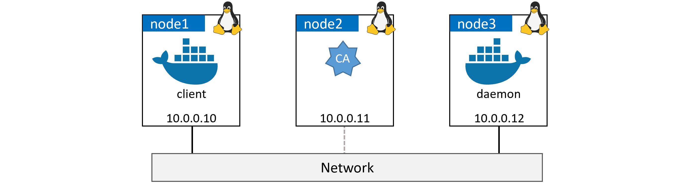

# Lab setup

The high-level process will be as follows:

1. Configure a CA and certificates
2. Create a CA
3. Create and sign keys for the Daemon
4. Create and sign keys for the Client
5. Distribute keys
6. Configure Docker to use TLS
7. Configure daemon mode
8. Configure client mode

## Create a CA (self-signed certs)
